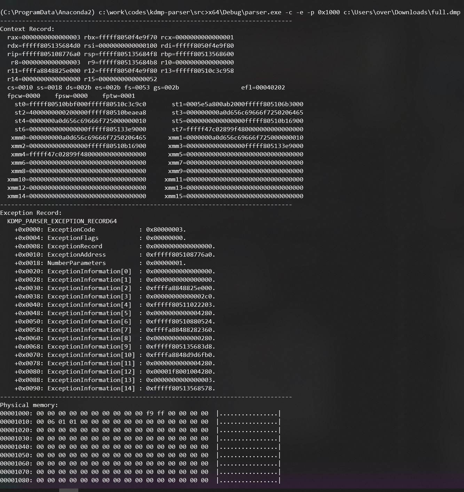

# kdmp-parser

[](https://ci.appveyor.com/project/0vercl0k/kdmp-parser)

This is a small C++ library able to parse Windows kernel full dump (`.dump /f` in WinDbg) as well as BMP dump (`.dump /ka` in WinDbg). The format has been introduced around Windows 8 timeframe according to the [rekall](https://github.com/google/rekall) project. Note that most of the structures used in [kdmp-parser-structs.h](https://github.com/0vercl0k/kdmp-parser/blob/master/src/kdmp-parser/kdmp-parser-structs.h) have been adapted / taken from the [rekall](https://github.com/google/rekall) project and their [Python implementation](https://github.com/google/rekall/blob/master/rekall-core/rekall/plugins/overlays/windows/crashdump.py).



The library supports only loading 64-bit dumps (but either x86 or x64 build can do that). It provides read access (no write access) to:

- The context record,
- The exception record,
- The physical memory.

Special cheers to [yrp604](https://github.com/yrp604) for being knowledgeable about it.

## Parser

The `parser.exe` application is a small utility made to dump various information about the dump file: exception record, context record, etc.

```text
kdmp-parser\src>x64\Debug\parser.exe -c -e -p 0x1000 full.dmp
--------------------------------------------------------------------------------
Context Record:
  rax=0000000000000003 rbx=fffff8050f4e9f70 rcx=0000000000000001
  rdx=fffff805135684d0 rsi=0000000000000100 rdi=fffff8050f4e9f80
  rip=fffff805108776a0 rsp=fffff805135684f8 rbp=fffff80513568600
   r8=0000000000000003  r9=fffff805135684b8 r10=0000000000000000
  r11=ffffa8848825e000 r12=fffff8050f4e9f80 r13=fffff80510c3c958
  r14=0000000000000000 r15=0000000000000052
  cs=0010 ss=0018 ds=002b es=002b fs=0053 gs=002b                 efl=00040202
  fpcw=0000    fpsw=0000    fptw=0001
    st0=fffff80510bbf000fffff80510c3c9c0       st1=0005e5a800ab2000fffff805106b3000
    st2=4000000000200000fffff80510beaea8       st3=000000000a0d656c69666f7250206465
    st4=0000000a0d656c69666f725000000010       st5=0000000000000000fffff80510b16900
    st6=0000000000000000fffff805133e9000       st7=fffff47c02899f480000000000000000
   xmm0=000000000a0d656c69666f7250206465      xmm1=0000000a0d656c69666f725000000010
   xmm2=0000000000000000fffff80510b16900      xmm3=0000000000000000fffff805133e9000
   xmm4=fffff47c02899f480000000000000000      xmm5=00000000000000000000000000000000
   xmm6=00000000000000000000000000000000      xmm7=00000000000000000000000000000000
   xmm8=00000000000000000000000000000000      xmm9=00000000000000000000000000000000
  xmm10=00000000000000000000000000000000     xmm11=00000000000000000000000000000000
  xmm12=00000000000000000000000000000000     xmm13=00000000000000000000000000000000
  xmm14=00000000000000000000000000000000     xmm15=00000000000000000000000000000000
--------------------------------------------------------------------------------
Exception Record:
  KDMP_PARSER_EXCEPTION_RECORD64
    +0x0000: ExceptionCode            : 0x80000003.
    +0x0004: ExceptionFlags           : 0x00000000.
    +0x0008: ExceptionRecord          : 0x0000000000000000.
    +0x0010: ExceptionAddress         : 0xfffff805108776a0.
    +0x0018: NumberParameters         : 0x00000001.
    +0x0020: ExceptionInformation[0]  : 0x0000000000000000.
    +0x0028: ExceptionInformation[1]  : 0x0000000000000000.
    +0x0030: ExceptionInformation[2]  : 0xffffa8848825e000.
    +0x0038: ExceptionInformation[3]  : 0x00000000000002c0.
    +0x0040: ExceptionInformation[4]  : 0xfffff80511022203.
    +0x0048: ExceptionInformation[5]  : 0x0000000000004280.
    +0x0050: ExceptionInformation[6]  : 0xfffff80510880524.
    +0x0058: ExceptionInformation[7]  : 0xffffa88488282360.
    +0x0060: ExceptionInformation[8]  : 0x0000000000000280.
    +0x0068: ExceptionInformation[9]  : 0xfffff805135683d8.
    +0x0070: ExceptionInformation[10] : 0xffffa8848d9d6fb0.
    +0x0078: ExceptionInformation[11] : 0x0000000000004280.
    +0x0080: ExceptionInformation[12] : 0x00001f8001004280.
    +0x0088: ExceptionInformation[13] : 0x0000000000000003.
    +0x0090: ExceptionInformation[14] : 0xfffff80513568578.
--------------------------------------------------------------------------------
Physical memory:
00001000: 00 00 00 00 00 00 00 00 00 00 f9 ff 00 00 00 00  |................|
00001010: 00 06 01 01 00 00 00 00 00 00 00 00 00 00 00 00  |................|
00001020: 00 00 00 00 00 00 00 00 00 00 00 00 00 00 00 00  |................|
00001030: 00 00 00 00 00 00 00 00 00 00 00 00 00 00 00 00  |................|
00001040: 00 00 00 00 00 00 00 00 00 00 00 00 00 00 00 00  |................|
00001050: 00 00 00 00 00 00 00 00 00 00 00 00 00 00 00 00  |................|
00001060: 00 00 00 00 00 00 00 00 00 00 00 00 00 00 00 00  |................|
00001070: 00 00 00 00 00 00 00 00 00 00 00 00 00 00 00 00  |................|
00001080: 00 00 00 00 00 00 00 00 00 00 00 00 00 00 00 00  |................|
00001090: 00 00 00 00 00 00 00 00 00 00 00 00 00 00 00 00  |................|
000010a0: 00 00 00 00 00 00 00 00 00 a0 87 00 00 00 00 00  |................|
000010b0: ff ff ff ff ff ff ff ff 00 00 60 11 05 f8 ff ff  |..........`.....|
000010c0: 00 90 2f 00 00 00 00 00 ff ff ff ff 03 80 ff ff  |../.............|
000010d0: f8 00 00 c0 c1 f7 ff ff 00 00 00 00 03 00 00 00  |................|
000010e0: f8 00 00 c0 c1 f7 ff ff 00 00 00 00 03 00 00 00  |................|
000010f0: 00 00 00 00 00 00 00 00 70 37 01 c0 c1 f7 ff ff  |........p7......|
...
```

## Building

You can build it using [Visual Studio 2019](https://visualstudio.microsoft.com/downloads/) by opening the `kdmp-parser.sln` solution file or via command line using `msbuild` (from a Visual Studio shell):

```text
kdmp-parser\src>msbuild -t:Build -p:Configuration=Debug
Microsoft (R) Build Engine version 16.4.0+e901037fe for .NET Framework
Copyright (C) Microsoft Corporation. All rights reserved.

Building the projects in this solution one at a time. To enable parallel build, please add the "-m" switch.
Build started 2/16/2020 3:44:32 PM.
Project "c:\work\codes\kdmp-parser\src\kdmp-parser.sln" on node 1 (Build target(s)).
ValidateSolutionConfiguration:
  Building solution configuration "Debug|x64".
Project "c:\work\codes\kdmp-parser\src\kdmp-parser.sln" (1) is building "c:\work\codes\kdmp-parser\src\test\test.vcxproj.metaproj" (2) on node 1 (default targets).
Project "c:\work\codes\kdmp-parser\src\test\test.vcxproj.metaproj" (2) is building "c:\work\codes\kdmp-parser\src\kdmp-parser\kdmp-parser.vcxproj" (3) on node 1 (default targets).
InitializeBuildStatus:
  Creating "x64\Debug\kdmp-parser.tlog\unsuccessfulbuild" because "AlwaysCreate" was specified.
ClCompile:
  All outputs are up-to-date.
Lib:
  All outputs are up-to-date.
  kdmp-parser.vcxproj -> c:\work\codes\kdmp-parser\src\x64\Debug\kdmp-parser.lib
FinalizeBuildStatus:
  Deleting file "x64\Debug\kdmp-parser.tlog\unsuccessfulbuild".
  Touching "x64\Debug\kdmp-parser.tlog\kdmp-parser.lastbuildstate".
Done Building Project "c:\work\codes\kdmp-parser\src\kdmp-parser\kdmp-parser.vcxproj" (default targets).

Project "c:\work\codes\kdmp-parser\src\test\test.vcxproj.metaproj" (2) is building "c:\work\codes\kdmp-parser\src\test\test.vcxproj" (4) on node 1 (default targets).
InitializeBuildStatus:
  Creating "x64\Debug\test.tlog\unsuccessfulbuild" because "AlwaysCreate" was specified.
ClCompile:
  All outputs are up-to-date.
Link:
  All outputs are up-to-date.
  test.vcxproj -> c:\work\codes\kdmp-parser\src\x64\Debug\test.exe
FinalizeBuildStatus:
  Deleting file "x64\Debug\test.tlog\unsuccessfulbuild".
  Touching "x64\Debug\test.tlog\test.lastbuildstate".
Done Building Project "c:\work\codes\kdmp-parser\src\test\test.vcxproj" (default targets).

Done Building Project "c:\work\codes\kdmp-parser\src\test\test.vcxproj.metaproj" (default targets).

Done Building Project "c:\work\codes\kdmp-parser\src\kdmp-parser.sln" (Build target(s)).


Build succeeded.
    0 Warning(s)
    0 Error(s)

Time Elapsed 00:00:00.52
```

## Testing

You can run `run-tests.py` from a Visual Studio command prompt to run basic tests. First, it builds every platform / configuration combination via `msbuild`, then it downloads two kernel dumps (one full dump and one bitmap dump) and runs every flavor of `test.exe` against the dumps.

```text
kdmp-parser>python run-tests.py
Microsoft (R) Build Engine version 16.4.0+e901037fe for .NET Framework
Copyright (C) Microsoft Corporation. All rights reserved.
[...]
Build succeeded.
    0 Warning(s)
    0 Error(s)

Time Elapsed 00:00:00.54
Microsoft (R) Build Engine version 16.4.0+e901037fe for .NET Framework
Copyright (C) Microsoft Corporation. All rights reserved.
[...]
Build succeeded.
    0 Warning(s)
    0 Error(s)

Time Elapsed 00:00:00.55
Microsoft (R) Build Engine version 16.4.0+e901037fe for .NET Framework
Copyright (C) Microsoft Corporation. All rights reserved.
[...]
Build succeeded.
    0 Warning(s)
    0 Error(s)

Time Elapsed 00:00:00.53
Microsoft (R) Build Engine version 16.4.0+e901037fe for .NET Framework
Copyright (C) Microsoft Corporation. All rights reserved.
[...]
Build succeeded.
    0 Warning(s)
    0 Error(s)

Time Elapsed 00:00:00.52
Successfully downloaded the test datas in C:\Users\over\AppData\Local\Temp\tmps0xoj46o, extracting..
Launching "src\x64\Release\test.exe C:\work\codes\kdmp-parser\full.dmp"..
GPRs matches the testdatas.
Launching "src\x64\Debug\test.exe C:\work\codes\kdmp-parser\full.dmp"..
GPRs matches the testdatas.
Launching "src\Release\test.exe C:\work\codes\kdmp-parser\full.dmp"..
GPRs matches the testdatas.
Launching "src\Debug\test.exe C:\work\codes\kdmp-parser\full.dmp"..
GPRs matches the testdatas.
Launching "src\x64\Release\test.exe C:\work\codes\kdmp-parser\bmp.dmp"..
GPRs matches the testdatas.
Launching "src\x64\Debug\test.exe C:\work\codes\kdmp-parser\bmp.dmp"..
GPRs matches the testdatas.
Launching "src\Release\test.exe C:\work\codes\kdmp-parser\bmp.dmp"..
GPRs matches the testdatas.
Launching "src\Debug\test.exe C:\work\codes\kdmp-parser\bmp.dmp"..
GPRs matches the testdatas.
All good!
```